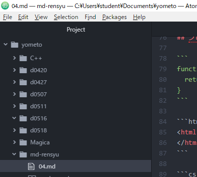

# h1 title

hello.   
hello. hello. hello. hello. hello.
hello. hello. hello. hello. hello. hello.
hello. hello. hello. hello. hello.

hello. hello. hello. hello. hello. hello.
hello. hello. hello. hello. hello. hello.
hello. hello. hello. hello. hello.

hello. hello. hello. hello. hello. hello.
hello. hello. hello. hello. hello. hello.
hello. hello. hello. hello. hello.

## 引用タブ
> quote. quote. quote. quote.   
quote. quote. quote. quote.   
quote. quote. quote. quote.   
quote. quote. quote.

# 区切り

---

***

___

hi title
===

## h2 title

h2 title
---

###### h6 title

## 強調
斜体*斜体斜体*斜体斜体_斜体斜体_斜体斜体斜体斜体斜体

太字**太字太字**太字__太字太字__太字  
太字太字太字


## 箇条書き
- ハイフンで箇条書き

    箇条書き箇条書き箇条書き箇条書き箇条書き箇条書き箇条書き箇条書き
    箇条書き箇条書き箇条書き  
    箇条書き箇条書き箇条書き箇条書き箇条書き  
    箇条書き箇条書き箇条書き箇条書き箇条書き箇条書き  
    箇条書き箇条書き箇条書き箇条書き箇条書き

- 箇条書きのインデント
  - スペース二つ箇条書きをすると、インデント
      - 二つスペースを増やすごとに段が下がる　

## 連番付きリスト
1. item1
1. item2
1. item3

## リンクの表現
<http://dotinstall.com>

[ドットインストール](http://dotinstall.com)

[ドットインストール](http://dotinstall.com "これはドットインストールです")

[README](README.md)

    TODO: 後で動きを試す

## プログラムコード

```
function x() {
  return x;
}
```

```html
<html>
</html>
```

```cs

void Start(){
  Debug.Log("こんにちは");
}
```

- C# cs
- C言語 c
- C++ c++
- java java
- html html

## 画像


### 画像のリンク

[](http://dotinstall.com)

### 自分の画像を表示



## テーブル

|:列見出し1|列見出し2|列見出し3|
|:-------|:-------:|---:|
|左揃え|中央揃え|右揃え|
|0|data|data|
